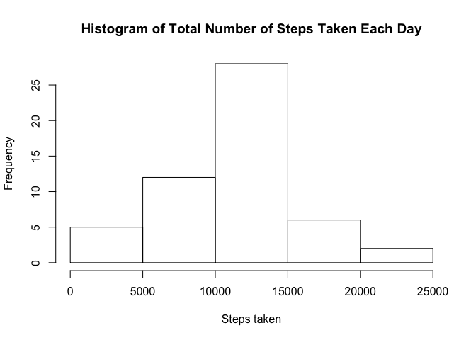
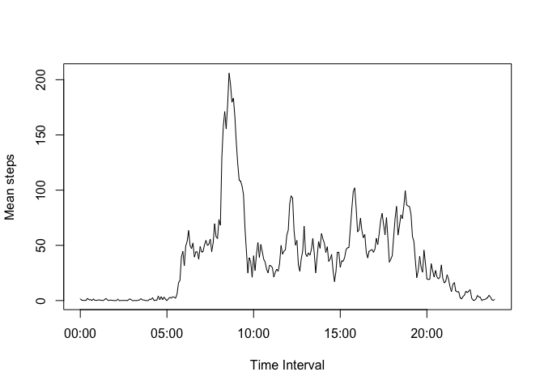
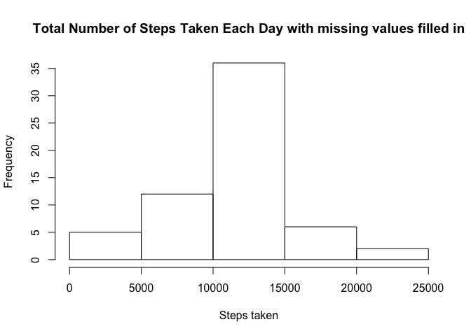

# Reproducible Research: Peer Assessment 1

## Loading and preprocessing the data


```r
dat <- read.csv("activity.csv")
```

## What is mean total number of steps taken per day?

1. Calculate the total number of steps taken per day

```r
stepsAday <- as.vector(tapply(dat$steps, dat$date, sum, na.rm=TRUE))
```

2. Make a histogram of the total number of steps taken each day

```r
hist(stepsAday, xlab="Steps taken", main="Histogram of Total Number of Steps Taken Each Day")
```

 

3. Calculate and report the mean and median of the total number of steps taken per day

Mean calculation

```r
meanPerDay <- tapply(dat$steps, dat$date, mean, na.rm=TRUE)
print(meanPerDay)
```

```
## 2012-10-01 2012-10-02 2012-10-03 2012-10-04 2012-10-05 2012-10-06 
##        NaN  0.4375000 39.4166667 42.0694444 46.1597222 53.5416667 
## 2012-10-07 2012-10-08 2012-10-09 2012-10-10 2012-10-11 2012-10-12 
## 38.2465278        NaN 44.4826389 34.3750000 35.7777778 60.3541667 
## 2012-10-13 2012-10-14 2012-10-15 2012-10-16 2012-10-17 2012-10-18 
## 43.1458333 52.4236111 35.2048611 52.3750000 46.7083333 34.9166667 
## 2012-10-19 2012-10-20 2012-10-21 2012-10-22 2012-10-23 2012-10-24 
## 41.0729167 36.0937500 30.6284722 46.7361111 30.9652778 29.0104167 
## 2012-10-25 2012-10-26 2012-10-27 2012-10-28 2012-10-29 2012-10-30 
##  8.6527778 23.5347222 35.1354167 39.7847222 17.4236111 34.0937500 
## 2012-10-31 2012-11-01 2012-11-02 2012-11-03 2012-11-04 2012-11-05 
## 53.5208333        NaN 36.8055556 36.7048611        NaN 36.2465278 
## 2012-11-06 2012-11-07 2012-11-08 2012-11-09 2012-11-10 2012-11-11 
## 28.9375000 44.7326389 11.1770833        NaN        NaN 43.7777778 
## 2012-11-12 2012-11-13 2012-11-14 2012-11-15 2012-11-16 2012-11-17 
## 37.3784722 25.4722222        NaN  0.1423611 18.8923611 49.7881944 
## 2012-11-18 2012-11-19 2012-11-20 2012-11-21 2012-11-22 2012-11-23 
## 52.4652778 30.6979167 15.5277778 44.3993056 70.9270833 73.5902778 
## 2012-11-24 2012-11-25 2012-11-26 2012-11-27 2012-11-28 2012-11-29 
## 50.2708333 41.0902778 38.7569444 47.3819444 35.3576389 24.4687500 
## 2012-11-30 
##        NaN
```


Median calculation

```r
medianPerDay <- tapply(dat$steps, dat$date, median, na.rm=TRUE)
print(medianPerDay)
```

```
## 2012-10-01 2012-10-02 2012-10-03 2012-10-04 2012-10-05 2012-10-06 
##         NA          0          0          0          0          0 
## 2012-10-07 2012-10-08 2012-10-09 2012-10-10 2012-10-11 2012-10-12 
##          0         NA          0          0          0          0 
## 2012-10-13 2012-10-14 2012-10-15 2012-10-16 2012-10-17 2012-10-18 
##          0          0          0          0          0          0 
## 2012-10-19 2012-10-20 2012-10-21 2012-10-22 2012-10-23 2012-10-24 
##          0          0          0          0          0          0 
## 2012-10-25 2012-10-26 2012-10-27 2012-10-28 2012-10-29 2012-10-30 
##          0          0          0          0          0          0 
## 2012-10-31 2012-11-01 2012-11-02 2012-11-03 2012-11-04 2012-11-05 
##          0         NA          0          0         NA          0 
## 2012-11-06 2012-11-07 2012-11-08 2012-11-09 2012-11-10 2012-11-11 
##          0          0          0         NA         NA          0 
## 2012-11-12 2012-11-13 2012-11-14 2012-11-15 2012-11-16 2012-11-17 
##          0          0         NA          0          0          0 
## 2012-11-18 2012-11-19 2012-11-20 2012-11-21 2012-11-22 2012-11-23 
##          0          0          0          0          0          0 
## 2012-11-24 2012-11-25 2012-11-26 2012-11-27 2012-11-28 2012-11-29 
##          0          0          0          0          0          0 
## 2012-11-30 
##         NA
```


## What is the average daily activity pattern?

1. Make a time series plot (i.e. type = "l") of the 5-minute interval (x-axis) and the average number of steps taken, averaged across all days (y-axis)

Calculating mean steps across all days by interval

```r
meanStepsInterval<-tapply(dat$steps, dat$interval, mean, na.rm=TRUE)
```

Obtaining labels to use as x-axis in the plot 

```r
intervalname <- strptime(sprintf("%04d", as.numeric(names(meanStepsInterval))), format="%H%M")
```

Plotting

```r
plot(intervalname, meanStepsInterval, type="l", xlab="Time Interval", ylab="Mean steps")
```

 

2. Which 5-minute interval, on average across all the days in the dataset, contains the maximum number of steps?

First number in output is the 5-minute interval with maximum number of steps

```r
which.max(meanStepsInterval)
```

```
## 835 
## 104
```


## Imputing missing values
1. Calculate and report the total number of missing values in the dataset (i.e. the total number of rows with NAs)


```r
dim(dat[!complete.cases(dat),])[1]
```

```
## [1] 2304
```

2. Devise a strategy for filling in all of the missing values in the dataset. The strategy does not need to be sophisticated. For example, you could use the mean/median for that day, or the mean for that 5-minute interval, etc.

Decided to fill in missing values with the mean for that 5-minute interval as calculated in previous step, which is stored in array meanStepsInterval


```r
# 5-minute intervals stored in variable numInterval as integers
numInterval <- as.integer(names(meanStepsInterval))

# mean number of steps on each interval stored in stepsAvgVar
stepsAvgVar <- as.vector(meanStepsInterval)

# newDataframe conformed with these two variables, which will be used in following step numbered 3
newDataframe <- data.frame(interval=numInterval, stepsAvg = stepsAvgVar)
```

3. Create a new dataset that is equal to the original dataset but with the missing data filled in.


```r
# original dataframe dat and newDataframe are merged by interval
mergedData <- merge(dat, newDataframe, by = c("interval"))

# all NA values in attribute steps are replaced with attribute stepsAVG
for (i in 1:dim(mergedData)[1]) {
    if (is.na(mergedData$steps[i])) mergedData$steps[i]<-mergedData$stepsAvg[i]
}

#attribute stepsAvg is removed
mergedData$stepsAvg <- NULL

# data frame dat has no NA values now
dat <- mergedData
```

4. Make a histogram of the total number of steps taken each day and Calculate and report the mean and median total number of steps taken per day. 

a. Calculate the total number of steps taken per day

```r
stepsAday2 <- as.vector(tapply(dat$steps, dat$date, sum, na.rm=TRUE))
```

b. Make a histogram of the total number of steps taken each day

```r
hist(stepsAday2, xlab="Steps taken", main="Histogram of Total Number of Steps Taken Each Day")
```

 

c. Calculate and report the mean and median of the total number of steps taken per day

Mean calculation

```r
meanPerDay2 <- tapply(dat$steps, dat$date, mean, na.rm=TRUE)
print(meanPerDay2)
```

```
## 2012-10-01 2012-10-02 2012-10-03 2012-10-04 2012-10-05 2012-10-06 
## 37.3825996  0.4375000 39.4166667 42.0694444 46.1597222 53.5416667 
## 2012-10-07 2012-10-08 2012-10-09 2012-10-10 2012-10-11 2012-10-12 
## 38.2465278 37.3825996 44.4826389 34.3750000 35.7777778 60.3541667 
## 2012-10-13 2012-10-14 2012-10-15 2012-10-16 2012-10-17 2012-10-18 
## 43.1458333 52.4236111 35.2048611 52.3750000 46.7083333 34.9166667 
## 2012-10-19 2012-10-20 2012-10-21 2012-10-22 2012-10-23 2012-10-24 
## 41.0729167 36.0937500 30.6284722 46.7361111 30.9652778 29.0104167 
## 2012-10-25 2012-10-26 2012-10-27 2012-10-28 2012-10-29 2012-10-30 
##  8.6527778 23.5347222 35.1354167 39.7847222 17.4236111 34.0937500 
## 2012-10-31 2012-11-01 2012-11-02 2012-11-03 2012-11-04 2012-11-05 
## 53.5208333 37.3825996 36.8055556 36.7048611 37.3825996 36.2465278 
## 2012-11-06 2012-11-07 2012-11-08 2012-11-09 2012-11-10 2012-11-11 
## 28.9375000 44.7326389 11.1770833 37.3825996 37.3825996 43.7777778 
## 2012-11-12 2012-11-13 2012-11-14 2012-11-15 2012-11-16 2012-11-17 
## 37.3784722 25.4722222 37.3825996  0.1423611 18.8923611 49.7881944 
## 2012-11-18 2012-11-19 2012-11-20 2012-11-21 2012-11-22 2012-11-23 
## 52.4652778 30.6979167 15.5277778 44.3993056 70.9270833 73.5902778 
## 2012-11-24 2012-11-25 2012-11-26 2012-11-27 2012-11-28 2012-11-29 
## 50.2708333 41.0902778 38.7569444 47.3819444 35.3576389 24.4687500 
## 2012-11-30 
## 37.3825996
```


Median calculation

```r
medianPerDay2 <- tapply(dat$steps, dat$date, median, na.rm=TRUE)
print(medianPerDay2)
```

```
## 2012-10-01 2012-10-02 2012-10-03 2012-10-04 2012-10-05 2012-10-06 
##   34.11321    0.00000    0.00000    0.00000    0.00000    0.00000 
## 2012-10-07 2012-10-08 2012-10-09 2012-10-10 2012-10-11 2012-10-12 
##    0.00000   34.11321    0.00000    0.00000    0.00000    0.00000 
## 2012-10-13 2012-10-14 2012-10-15 2012-10-16 2012-10-17 2012-10-18 
##    0.00000    0.00000    0.00000    0.00000    0.00000    0.00000 
## 2012-10-19 2012-10-20 2012-10-21 2012-10-22 2012-10-23 2012-10-24 
##    0.00000    0.00000    0.00000    0.00000    0.00000    0.00000 
## 2012-10-25 2012-10-26 2012-10-27 2012-10-28 2012-10-29 2012-10-30 
##    0.00000    0.00000    0.00000    0.00000    0.00000    0.00000 
## 2012-10-31 2012-11-01 2012-11-02 2012-11-03 2012-11-04 2012-11-05 
##    0.00000   34.11321    0.00000    0.00000   34.11321    0.00000 
## 2012-11-06 2012-11-07 2012-11-08 2012-11-09 2012-11-10 2012-11-11 
##    0.00000    0.00000    0.00000   34.11321   34.11321    0.00000 
## 2012-11-12 2012-11-13 2012-11-14 2012-11-15 2012-11-16 2012-11-17 
##    0.00000    0.00000   34.11321    0.00000    0.00000    0.00000 
## 2012-11-18 2012-11-19 2012-11-20 2012-11-21 2012-11-22 2012-11-23 
##    0.00000    0.00000    0.00000    0.00000    0.00000    0.00000 
## 2012-11-24 2012-11-25 2012-11-26 2012-11-27 2012-11-28 2012-11-29 
##    0.00000    0.00000    0.00000    0.00000    0.00000    0.00000 
## 2012-11-30 
##   34.11321
```


Do these values differ from the estimates from the first part of the assignment? What is the impact of imputing missing data on the estimates of the total daily number of steps?

Yes these values differ from the estimates from the first part. Imputing missing data impacted on the estimates as there are no NA median values now. Also, latter histogram shows a decrease in the frequency for the range 0-5000, and there is an increase in frequency for the range 10000-15000, that is fixed NAs added up to this range of number of steps taken. The data distribution actually looks more normal. 

## Are there differences in activity patterns between weekdays and weekends?
