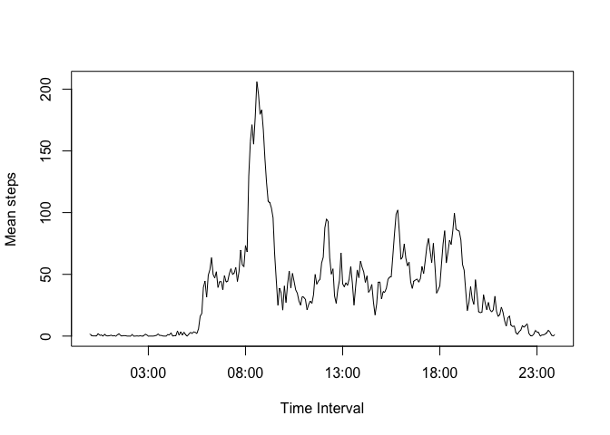

# Reproducible Research: Peer Assessment 1

## Loading and preprocessing the data


```r
dat <- read.csv("activity.csv")
```

## What is mean total number of steps taken per day?

1. Calculate the total number of steps taken per day

```r
stepsAday <- as.vector(tapply(dat$steps, dat$date, sum))
```

2. Make a histogram of the total number of steps taken each day

```r
hist(stepsAday, xlab="Steps taken", main="Histogram of Total Number of Steps Taken Each Day")
```

 

3. Calculate and report the mean and median of the total number of steps taken per day

Mean calculation

```r
meanPerDay <- mean(stepsAday, na.rm = TRUE)
print(meanPerDay)
```

```
## [1] 10766.19
```


Median calculation

```r
medianPerDay <- median(stepsAday, na.rm = TRUE)
print(medianPerDay)
```

```
## [1] 10765
```


## What is the average daily activity pattern?

1. Make a time series plot (i.e. type = "l") of the 5-minute interval (x-axis) and the average number of steps taken, averaged across all days (y-axis)

Calculating mean steps across all days by interval

```r
meanStepsInterval<-tapply(dat$steps, dat$interval, mean, na.rm=TRUE)
```

Obtaining labels to use as x-axis in the plot 

```r
intervalname <- strptime(sprintf("%04d", as.numeric(names(meanStepsInterval))), format="%H%M")
```

Plotting

```r
plot(intervalname, meanStepsInterval, type="l", xlab="Time Interval", ylab="Mean steps")
```

 

2. Which 5-minute interval, on average across all the days in the dataset, contains the maximum number of steps?

First number in output is the 5-minute interval with maximum number of steps

```r
which.max(meanStepsInterval)
```

```
## 835 
## 104
```


## Imputing missing values
1. Calculate and report the total number of missing values in the dataset (i.e. the total number of rows with NAs)


```r
dim(dat[!complete.cases(dat),])[1]
```

```
## [1] 2304
```

2. Devise a strategy for filling in all of the missing values in the dataset. The strategy does not need to be sophisticated. For example, you could use the mean/median for that day, or the mean for that 5-minute interval, etc.

Decided to fill in missing values with the mean for that 5-minute interval as calculated in previous step, which is stored in array meanStepsInterval


```r
# 5-minute intervals stored in variable numInterval as integers
numInterval <- as.integer(names(meanStepsInterval))

# mean number of steps on each interval stored in stepsAvgVar
stepsAvgVar <- as.vector(meanStepsInterval)

# newDataframe conformed with these two variables, which will be used in following step numbered 3
newDataframe <- data.frame(interval=numInterval, stepsAvg = stepsAvgVar)
```

3. Create a new dataset that is equal to the original dataset but with the missing data filled in.


```r
# original dataframe dat and newDataframe are merged by interval
mergedData <- merge(dat, newDataframe, by = c("interval"))

# all NA values in attribute steps are replaced with attribute stepsAVG
missingValues <- is.na(mergedData$steps)
mergedData$steps[missingValues] <- mergedData$stepsAvg[missingValues]

#attribute stepsAvg is removed
mergedData$stepsAvg <- NULL

# data frame dat has no NA values now
dat <- mergedData
```

4. Make a histogram of the total number of steps taken each day and Calculate and report the mean and median total number of steps taken per day. 

a. Calculate the total number of steps taken per day

```r
stepsAday2 <- as.vector(tapply(dat$steps, dat$date, sum))
```

b. Make a histogram of the total number of steps taken each day

```r
hist(stepsAday2, xlab="Steps taken", main="Total Number of Steps Taken Each Day with missing values filled in")
```

 

c. Calculate and report the mean and median of the total number of steps taken per day

Mean calculation

```r
meanPerDay2 <- mean(stepsAday2)
print(meanPerDay2)
```

```
## [1] 10766.19
```


Median calculation

```r
medianPerDay2 <- median(stepsAday2)
print(medianPerDay2)
```

```
## [1] 10766.19
```


Do these values differ from the estimates from the first part of the assignment? What is the impact of imputing missing data on the estimates of the total daily number of steps?

Yes these values differ from the estimates from the first part. Imputing missing data impacted on the estimates, now both the mean and the median are the same.  

## Are there differences in activity patterns between weekdays and weekends?

First, classDay factor variable is added to dataframe dat to indicate wether date is Weekday or Weekend


```r
dat$classDay <- as.factor(ifelse(weekdays(as.Date(dat$date)) %in% c("Saturday", "Sunday"), "Weekend", "Weekday"))

head(dat)
```

```
##   interval    steps       date classDay
## 1        0 1.716981 2012-10-01  Weekday
## 2        0 0.000000 2012-11-23  Weekday
## 3        0 0.000000 2012-10-28  Weekend
## 4        0 0.000000 2012-11-06  Weekday
## 5        0 0.000000 2012-11-24  Weekend
## 6        0 0.000000 2012-11-15  Weekday
```

Second, average steps taken during each interval are calculated by classDay (Weekday/Weekend)


```r
avgIntervalDayOfWeek <- aggregate(steps ~ interval + classDay, data=dat, FUN=mean)

head(avgIntervalDayOfWeek)
```

```
##   interval classDay      steps
## 1        0  Weekday 2.25115304
## 2        5  Weekday 0.44528302
## 3       10  Weekday 0.17316562
## 4       15  Weekday 0.19790356
## 5       20  Weekday 0.09895178
## 6       25  Weekday 1.59035639
```

Third, plot of average of steps taken by interval and classDay


```r
library(ggplot2)
ggplot(avgIntervalDayOfWeek,aes(interval, steps)) + geom_line() + facet_grid(classDay ~ .)
```

 

So, answer is Yes, there is a difference in activity patterns between weekdays and weekends. Activity starts earlier on weekdays, there is a peak at starting of working hours and then it decreases for the rest of the day. In contrast, on weekends activity starts later that in weekdays and it remains almost constant throughout the day.


